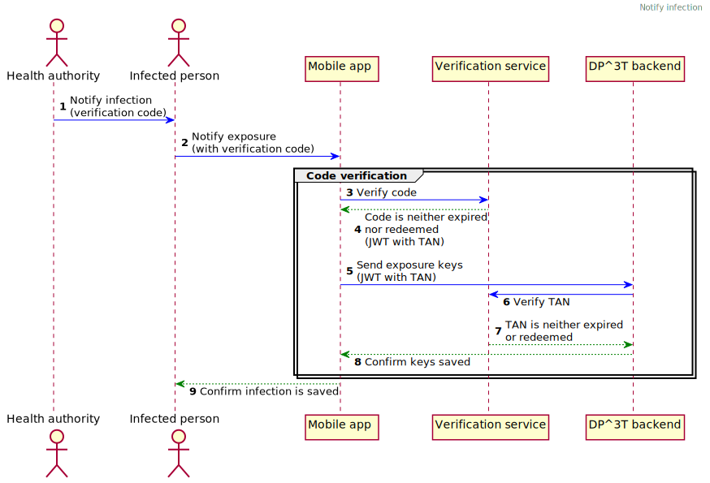

# RadarCOVID DP^3T Fork

<p align="center">
    <a href="https://github.com/RadarCOVID/radar-covid-backend-dp3t-server/commits/" title="Last Commit"></a>
    <a href="https://github.com/RadarCOVID/radar-covid-backend-dp3t-server/issues" title="Open Issues"></a>
    <a href="https://github.com/RadarCOVID/radar-covid-backend-dp3t-server/blob/master/LICENSE" title="License"></a>
</p>

Fork from [DP3T-Backend-SDK](https://github.com/DP-3T/dp3t-sdk-backend) with the following changes:

- Functional:
  - When a patient gets a verification code, he/she will set the code in the mobile application to report the exposition keys.
  - Mobile application will connect to the Verification Service to check the code validation. If it is valid, Verification Service will return a token.
  - Mobile application will connect to this service (DP3T Server) with the JWT and exposition keys.
  - DP3T Server will get the information from the token and communicate with Verification Service to redeem the Transaction Number (TAN).

  

  You can find these changes in this [package](./dpppt-backend-sdk/dpppt-backend-sdk-ws/src/main/java/org/dpppt/backend/sdk/ws/radarcovid).

- Technical:
  - OpenAPI generation using [springdoc-openapi](https://github.com/springdoc/springdoc-openapi).
  - Protocol Buffers compilation with [protoc-jar-maven-plugin](https://github.com/os72/protoc-jar-maven-plugin) and moving `.proto` files to [`dpppt-backend-sdk-model/src/main/proto`](./dpppt-backend-sdk/dpppt-backend-sdk-model/src/main/proto).
  - Upgraded versions (PostgreSQL, Tomcat, Spring Boot,...).

See [PR](https://github.com/DP-3T/dp3t-sdk-backend/pull/143) with changes we requested to DP3T.

## Installation and Getting Started

### Building from Source

To build the project, you need to run this command:

```shell
mvn clean package -P <environment>
```

Where `<environment>` has these possible values:

- `radarcovid-local`. To run the application from local (eg, from IDE o from Maven using `mvn spring-boot:run`). It is the default profile, using [`application.yml`](./dpppt-backend-sdk/dpppt-backend-sdk-ws/src/main/docker/application.yml) configuration file. If any properties need to be modified, you can create application-radarcovid-local.yml configuration file.
- `radarcovid-docker`. To run the application in a Docker container with `docker-compose`, using [`application.yml`](./dpppt-backend-sdk/dpppt-backend-sdk-ws/src/main/docker/application.yml) configuration file. If any properties need to be modified, you can create application-docker.yml configuration file.
- `radarcovid-pre`. To run the application in the Preproduction environment.  Preproduction environment properties are configured in the infrastructure.
- `radarcovid-pro`. To run the application in the Production environment.  Production environment properties are configured in the infrastructure.

The project also uses Maven profile `aws-env` to include dependencies when it is running on AWS environment, so the compilation command for Preproduction and Production environments would be:

```shell
mvn clean package -P radarcovid-env,aws-env
mvn clean package -P radarcovid-pro,aws-env
```

All profiles will load the default [configuration](./dpppt-backend-sdk/dpppt-backend-sdk-ws/src/main/docker/application.yml).

Application uses [The Twelve-Factor App - Config](https://12factor.net/config) approach so configuration is stored in _environment variables_.

## Support and Feedback
The following channels are available for discussions, feedback, and support requests:

| Type       | Channel                                                |
| ---------- | ------------------------------------------------------ |
| **Issues** | <a href="https://github.com/RadarCOVID/radar-covid-backend-dp3t-server/issues" title="Open Issues"></a> |

## Contribute

If you want to contribute with this exciting project follow the steps in [How to create a Pull Request in GitHub](https://opensource.com/article/19/7/create-pull-request-github).

More details in [CONTRIBUTING.md](./CONTRIBUTING.md).

## License

This Source Code Form is subject to the terms of the [Mozilla Public License, v. 2.0](https://www.mozilla.org/en-US/MPL/2.0/).
